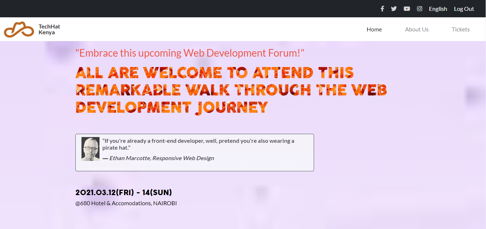

# Conference website

Capstone Project

- The project is an individual assessment to demonstrate the existing knowledge of HTML and CSS and Bootstrap. It entails building a website for a Web development conference that is set to occur very soon.
- I opted to build one that applies to TechHat Company. It has three pages.

1. The Home page
2. The About page
3. The Tickets page

Each of these pages have versions for 2 different screen sizes:

mobile: up to 768px
desktop: from 768px

<i>Built With HTML5, CSS3, Bootstrap GIT, and VSCODE</i>

<h1>Live Demo</h1>

[Live Demo](https://leon-mbegera.github.io/ConferencePage/)

<h1>Getting Started</h1>

To get a local copy up and running follow these simple example steps.

 - Go to https://leon-mbegera.github.io/ConferencePage/
 - From here, you'll be able to copy repository/directory link from GitHub.
 - Use git bash to clone this repository on your local machine and you can view and edit it in your code editor
 - Run `git checkout -b your-branch-name`. To Make your desired contributions
 - Push your contributions from your branch up to your forked repository
 - Open a Pull Request with a detailed description of the development branch of the original project for a review

Prerequisites Text editor, Github profile and Git.

<h2>Author</h2>

👤 Leon Mbegera Kabati

- Github: [@Leon-Mbegera](https://github.com/Leon-Mbegera)
- Linkedin: [leon mbegera](https://www.linkedin.com/in/leon-mbegera-053991174/)
<h2>
🤝 Contributing 
</h2>
Contributions, issues and feature requests are welcome!

Feel free to check the issues page.

Show your support Give a ⭐️ if you like this project!

📝 License This project is a collaboration project of microverse students. All rights are reserved for Leon Mbegera
